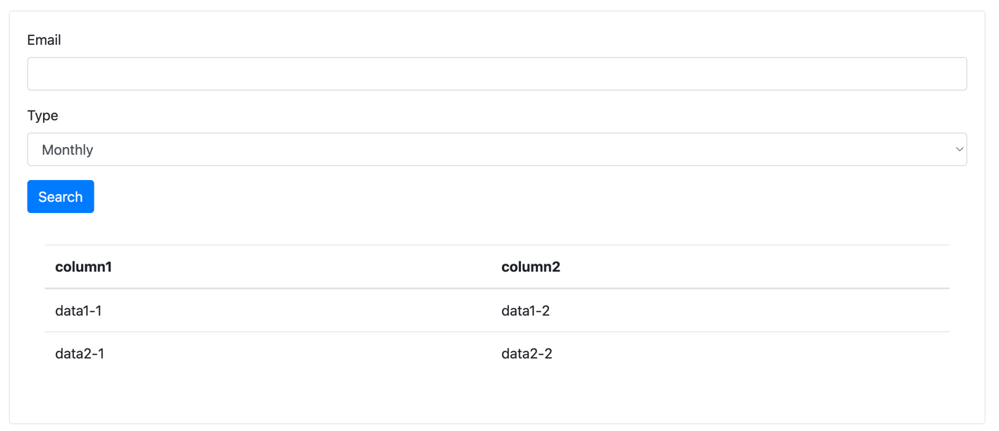

# curly-octo-bassoon

DSL of Web Tools for Developers

## What is it?

Render this code

```kotlin
page {
    val emailInput = input(
        title = "Eamil",
    )
    val typeSelect = select(
        title = "Type",
        values = mapOf(
            1 to "Monthly",
            2 to "Infinite",
        ),
    )
    val dataStore = store()
    button(
        title = "Search",
        action = LoadData(
            source = Source(
                url = "https://api.server/example1/page1",
                payload = mapOf(
                    "email" to ref(emailInput),
                    "voucher" to ref(typeSelect),
                )
            ),
            store = dataStore,
        ),
    )
    table(
        store = dataStore,
    )
}
```
to

